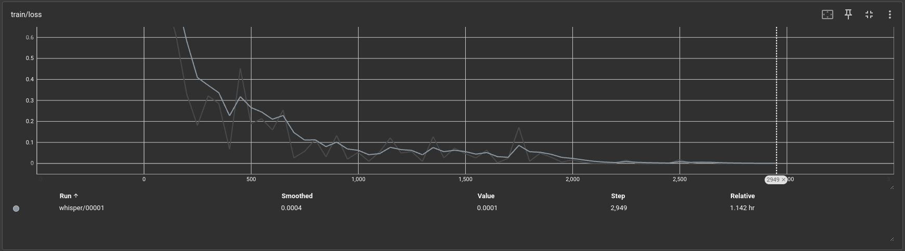

# Premisa

Se requiere implementar un módulo de procesamiento de lenguaje natural para la gestión del ingreso de autos a un estacionamiento.

## Supuestos

- El estacionamiento está ubicado en Argentina.
- Se requiere pedir la patente, un estimativo de el tiempo de estadía y si se prefiere estacionamiento techado.

# Entregable

El sistema ya está implementado utilizando el modelo de OpenAI, whisper. 
Se refinará esta implementación utilizando un dataset de audios de Argentina, para mejorar el rendimiento con el acento local.
El dataset fué modificado para que las transcripciones contengan los números expresados en formato númerico y no como palabras (ej: 12 en lugar de doce). Esto es preferible para el procesamiento de patentes y horarios.

En la imgen se muestra la arquitectura que whisper utiliza. Se reentrenarán los parámetros de la RNN que predice autoregresivamente los tokens, pero el mecanismo para embeber los tokens y la CNN utilizada en la extraccíon de caracteristicas, permanecen intactos.

# El dataset

El dataset original está repartido en 3 partes, es_ar_female, es_ar_male y es_weather_messages.
Estos contienen cada uno, una carpeta con múltiples archivos .wav y un archivo .tsv.
Cada .tsv contiene 2 columnas, en donde la primera indica el nombre del archivo .wav al que se corresponde y la segunda la transcripción del audio.
Todos los tsv fueron editados, como se expilcó anteriormente, para contener todos los números en formato numérico. La versión editada tiene el sufijo '_numeros' añadido a su nombre.
Luego se los concatenó a todos en un solo .tsv llamado 'transcripciones.tsv'.

Por otro lado todos los .wav fueron movidos a una única carpeta llamada 'audios'.

# El código

## Común

En el archivo 'comun.py' se definen todos los módulos comunes al entrenamiento y a la carga del modelo para probarlo.

- Toda la funcionalidad de entrenamiento se encapsula en la clase WhisperModelModule usando el LightningModule, esto solo organiza las funciones que regularmente se utilizan al entrenar una red neuronal en una clase. Aquí, se crean los DataLoaders para entrenamiento y validación, se configuran los optimizadores, y se definen los pasos de entrenamiento y validación.
- El optimizador que se utiliza es el AdamW, un tipo de descenso de gradiente estocástico basado en la estimación de los momentos de primer y segundo orden con un mecanismo de decaimiento de los pesos. Se lo eligió en base a las recomendaciones de OpenAI sobre refinar su modelo. AdamW es recomendadopor su eficiencia tanto computacional como en el uso de memoria, muy útil para modelos con muchos parámetros como este, y por la invariancia ante el escalado diagonal de los gradientes.
- El dataset es encapsulado en la clase SpeechDataset
- La clase WhisperDataCollatorWithPadding es usada coma la collate_fn de los DataLoaders de pytorch. Se la encapsula en una clase por consistencia. Este se encarga de utilizar padding al final de cada transcripción para que todos los labels tengan el mismo largo.
- La clase Config define todos los metaparámetros que, en este caso, están tomados según las recomendaciones de OpenAI.

## Fine Tune

En el archivo 'fine_tune.py' se inicializan los módulos comunes y se ejecutan 10 epochs de entrenamiento. En cada epoch se guarda un checkpoint, en la carpeta artifacts, y se loggean todos los resultados del entrenamiento para ser vistos con tensorboard.

Para verlos se puede usar el comando siguiente:

~~~shell
tensorboard  --logdir=tensor_logs/
~~~

## Ref Test

Viendo la evolución de la función Loss, tanto de entrenamiento como de evaluación, vemos como el modelo mejora a lo largo de los 10 epochs. Por lo tanto, utilizo el último checkpoint.

En el código 'ref_test.py' solo imprimo el 'char error rate' y muestro las transcripciones hechas por el modelo junto a las esperadas para una evaluación manual, a modo de 'sanity-check'.

# Integración 

En la carpeta 'estacionamiento' está el modulo para la adquicición de patentes del estacionamiento, en la inicializacion de la clase IA, en el archivo 'estacionamiento/ia/ia.py', se carga el último checkpoint para la utilización en el sistema.

# Ejecución 

## Entorno

Primero será necesario descomprimír el archivo 'muy_grande.zip', este archivo contiene la carpeta de audios del dataset y el ultimo checkpoint del modelo entrenado. Está por separado porque estos archivos binarios muy grandes realentizan mucho a git.

### Crear el entorno virtual:

~~~shell
python -m venv .venv
~~~

### Activar el entorno virtual:

~~~shell
source .venv/bin/activate
~~~

### Instalar las dependencias:

~~~shell
pip install -r requirements.txt
~~~

Y a su vez instalar la versión de pytorch que corresponda de [PyTorch](https://pytorch.org/).

## Para el modulo de estacionamiento:

~~~shell
python -m estacionamiento
~~~

